# FishUI

-- TODO: Add a table of contents --
-- TODO: Update the list of all implemented controls, bring the readme up to date

A dependency-free, immediate-mode-inspired GUI library for .NET applications with backend-agnostic rendering.

[](https://dotnet.microsoft.com/)
[](LICENSE)

It uses the Gwen skin
[](GWEN Skin)

## Overview

[![DeepWiki](https://img.shields.io/badge/DeepWiki-sbarisic%2FFishUI-blue.svg?logo=data:image/png;base64,iVBORw0KGgoAAAANSUhEUgAAACwAAAAyCAYAAAAnWDnqAAAAAXNSR0IArs4c6QAAA05JREFUaEPtmUtyEzEQhtWTQyQLHNak2AB7ZnyXZMEjXMGeK/AIi+QuHrMnbChYY7MIh8g01fJoopFb0uhhEqqcbWTp06/uv1saEDv4O3n3dV60RfP947Mm9/SQc0ICFQgzfc4CYZoTPAswgSJCCUJUnAAoRHOAUOcATwbmVLWdGoH//PB8mnKqScAhsD0kYP3j/Yt5LPQe2KvcXmGvRHcDnpxfL2zOYJ1mFwrryWTz0advv1Ut4CJgf5uhDuDj5eUcAUoahrdY/56ebRWeraTjMt/00Sh3UDtjgHtQNHwcRGOC98BJEAEymycmYcWwOprTgcB6VZ5JK5TAJ+fXGLBm3FDAmn6oPPjR4rKCAoJCal2eAiQp2x0vxTPB3ALO2CRkwmDy5WohzBDwSEFKRwPbknEggCPB/imwrycgxX2NzoMCHhPkDwqYMr9tRcP5qNrMZHkVnOjRMWwLCcr8ohBVb1OMjxLwGCvjTikrsBOiA6fNyCrm8V1rP93iVPpwaE+gO0SsWmPiXB+jikdf6SizrT5qKasx5j8ABbHpFTx+vFXp9EnYQmLx02h1QTTrl6eDqxLnGjporxl3NL3agEvXdT0WmEost648sQOYAeJS9Q7bfUVoMGnjo4AZdUMQku50McDcMWcBPvr0SzbTAFDfvJqwLzgxwATnCgnp4wDl6Aa+Ax283gghmj+vj7feE2KBBRMW3FzOpLOADl0Isb5587h/U4gGvkt5v60Z1VLG8BhYjbzRwyQZemwAd6cCR5/XFWLYZRIMpX39AR0tjaGGiGzLVyhse5C9RKC6ai42ppWPKiBagOvaYk8lO7DajerabOZP46Lby5wKjw1HCRx7p9sVMOWGzb/vA1hwiWc6jm3MvQDTogQkiqIhJV0nBQBTU+3okKCFDy9WwferkHjtxib7t3xIUQtHxnIwtx4mpg26/HfwVNVDb4oI9RHmx5WGelRVlrtiw43zboCLaxv46AZeB3IlTkwouebTr1y2NjSpHz68WNFjHvupy3q8TFn3Hos2IAk4Ju5dCo8B3wP7VPr/FGaKiG+T+v+TQqIrOqMTL1VdWV1DdmcbO8KXBz6esmYWYKPwDL5b5FA1a0hwapHiom0r/cKaoqr+27/XcrS5UwSMbQAAAABJRU5ErkJggg==)](https://deepwiki.com/sbarisic/FishUI)

FishUI is a flexible GUI framework that separates UI logic from rendering, allowing integration with any graphics library. It provides a comprehensive set of controls suitable for game development, tools, and applications.

**Key Principles:**
- **Backend Agnostic**: Implement your own graphics and input handlers via simple interfaces
- **Dependency Free**: Core library has no external dependencies except YamlDotNet for serialization
- **Game-Ready**: Designed for real-time applications with features like virtual cursor support
- **Themeable**: YAML-based theme system with atlas/9-slice support

## Screenshots

<p align="center">
  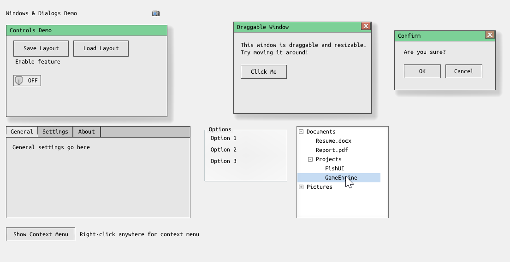
  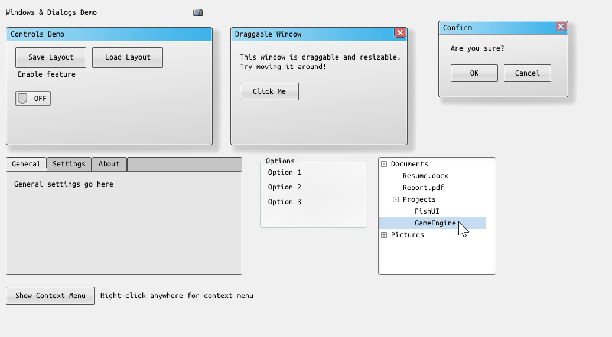
</p>
<p align="center">
  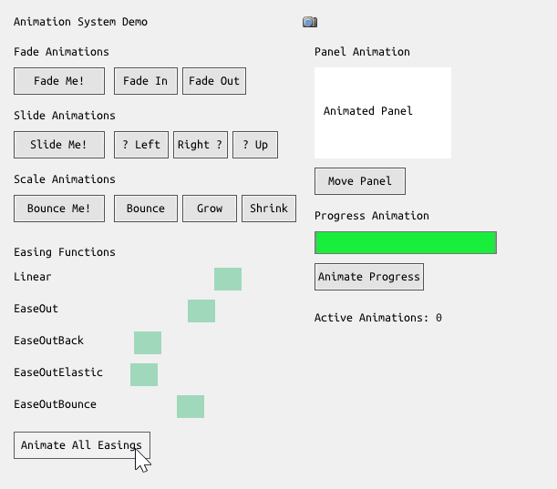
  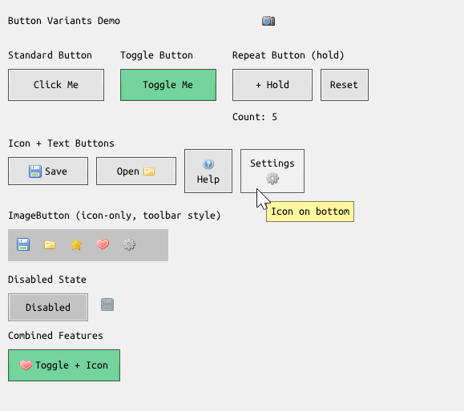
</p>
<p align="center">
  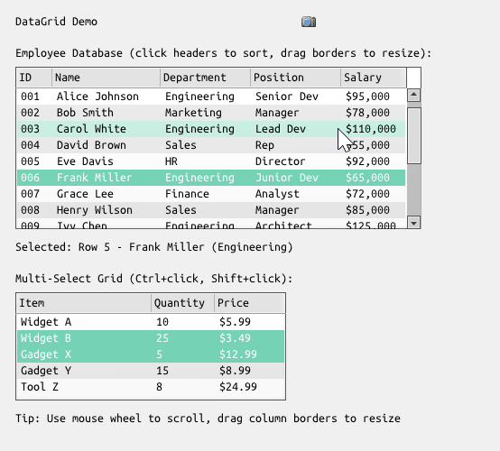
  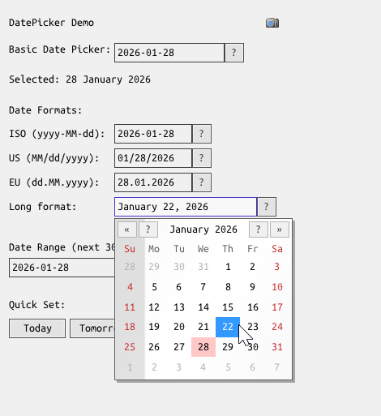
</p>
<p align="center">
  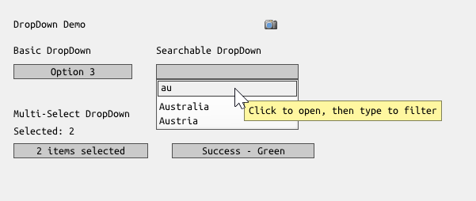
  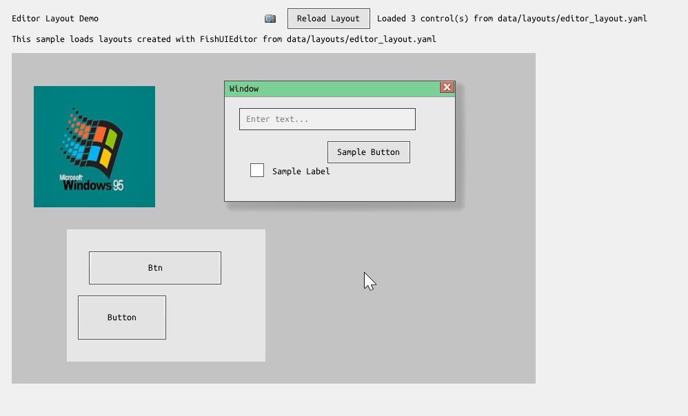
</p>
<p align="center">
  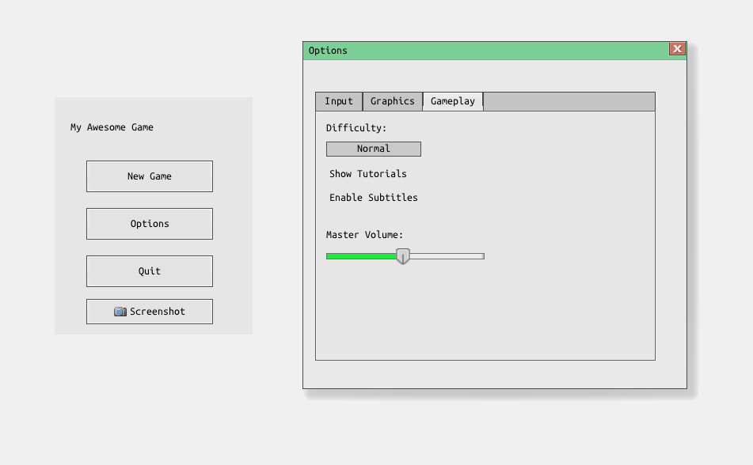
  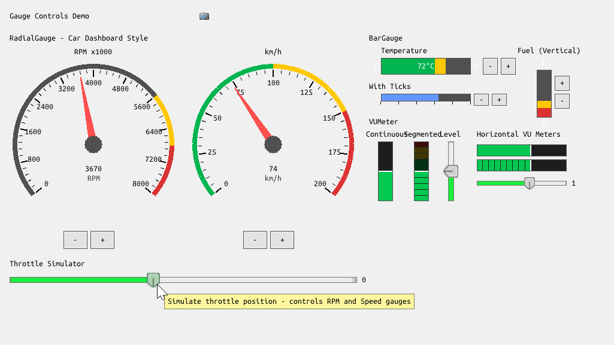
</p>
<p align="center">
  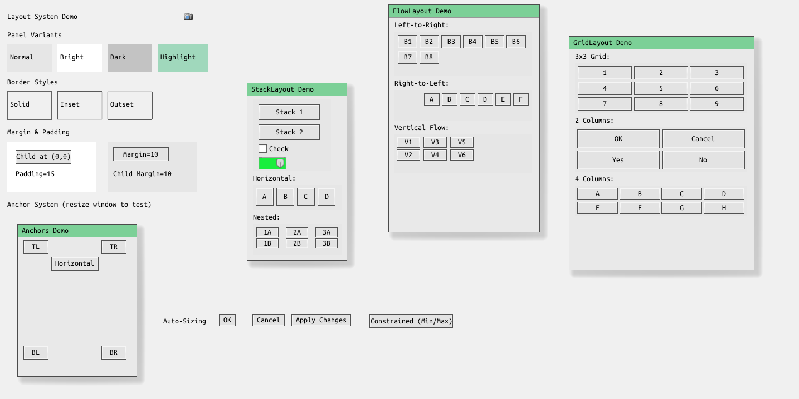
  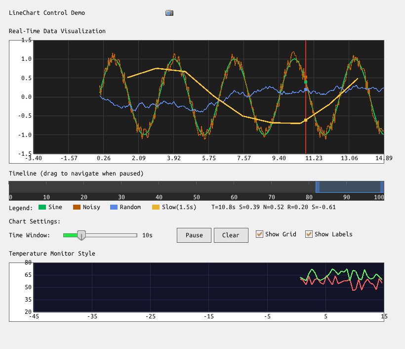
</p>
<p align="center">
  
  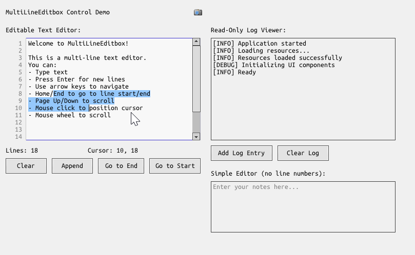
</p>
<p align="center">
  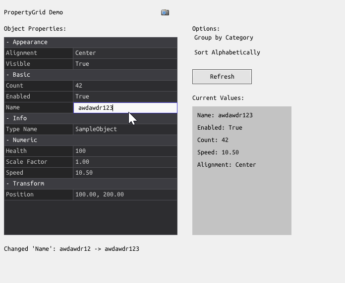
  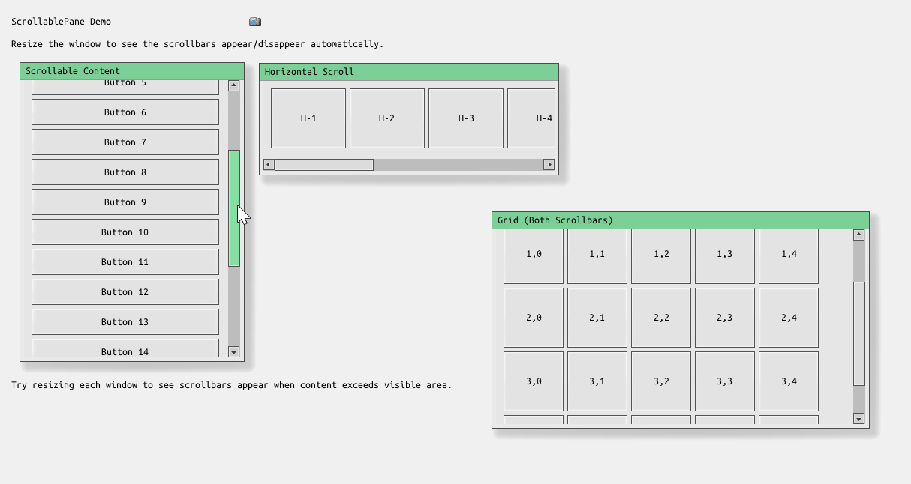
</p>
<p align="center">
  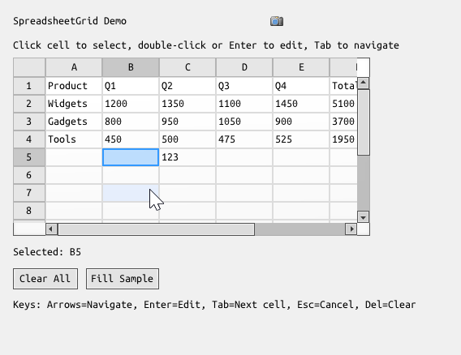
</p>

## Features

### Controls (40+ Built-in)

| Category | Controls |
|----------|----------|
| **Input** | Button, Textbox, CheckBox, RadioButton, ToggleSwitch, Slider, NumericUpDown, MultiLineEditbox |
| **Selection** | ListBox, DropDown (ComboBox), TreeView, SelectionBox, DatePicker, TimePicker |
| **Display** | Label, StaticText, ImageBox, AnimatedImageBox, ProgressBar, LineChart, Timeline |
| **Containers** | Panel, Window, GroupBox, TabControl, ScrollablePane, StackLayout, FlowLayout, GridLayout |
| **Navigation** | ScrollBarV, ScrollBarH, MenuBar, ContextMenu, MenuItem |
| **Gauges** | RadialGauge, BarGauge, VUMeter |
| **Data** | DataGrid, SpreadsheetGrid, PropertyGrid, ItemListbox |
| **Utility** | Tooltip, Titlebar |

### Framework Features

- **Layout System**: Absolute positioning, anchoring, margins/padding, StackLayout, FlowLayout, GridLayout
- **Theme System**: YAML themes with atlas regions, 9-slice/NPatch rendering, color overrides, inheritance
- **Serialization**: Save/load UI layouts to YAML files with event handler binding
- **Animation**: Built-in animation system with easing functions and tween helpers
- **Input**: Mouse, keyboard, touch, and virtual cursor (gamepad/keyboard navigation)
- **Events**: Control events, serializable event handlers, event broadcasting
- **UI Scaling**: Resolution-independent UI with configurable scale factor

## Projects

| Project | Description |
|---------|-------------|
| **FishUI** | Core library - all controls and interfaces |
| **FishUIEditor** | Visual layout editor for designing FishUI interfaces |
| **FishUIDemos** | Sample implementations using ISample interface |
| **FishUISample** | Raylib-based sample runner with GUI chooser |

## Quick Start

### 1. Implement Required Interfaces

FishUI requires three interfaces for your graphics backend:

```csharp
// Graphics rendering
public class MyGfx : IFishUIGfx
{
    public int ScreenWidth { get; set; }
    public int ScreenHeight { get; set; }
    
    public void Init() { }
    public void BeginDrawing(float dt) { }
    public void EndDrawing() { }
    
    public ImageRef LoadImage(string path) { /* ... */ }
    public FontRef LoadFont(string path, int size) { /* ... */ }
    
    public void DrawRectangle(Vector2 pos, Vector2 size, FishColor color) { /* ... */ }
    public void DrawImage(ImageRef img, Vector2 pos, float rot, float scale, FishColor color) { /* ... */ }
    public void DrawNPatch(NPatch patch, Vector2 pos, Vector2 size, FishColor color) { /* ... */ }
    public void DrawText(FontRef font, string text, Vector2 pos) { /* ... */ }
    // ... see IFishUIGfx for full interface
}

// Input handling
public class MyInput : IFishUIInput
{
    public Vector2 GetMousePosition() { /* ... */ }
    public bool IsMouseDown(FishMouseButton button) { /* ... */ }
    public bool IsMousePressed(FishMouseButton button) { /* ... */ }
    public bool IsKeyDown(FishKey key) { /* ... */ }
    public bool IsKeyPressed(FishKey key) { /* ... */ }
    public string GetTextInput() { /* ... */ }
    // ... see IFishUIInput for full interface
}

// Event broadcasting (optional)
public class MyEvents : IFishUIEvents
{
    public void Broadcast(FishUI ui, Control sender, string eventName, object[] data) { /* ... */ }
}
```

### 2. Initialize FishUI

```csharp
FishUISettings settings = new FishUISettings();
IFishUIGfx gfx = new MyGfx(800, 600);
IFishUIInput input = new MyInput();
IFishUIEvents events = new MyEvents();

FishUI.FishUI ui = new FishUI.FishUI(settings, gfx, input, events);
ui.Init();

// Load a theme
settings.LoadTheme("data/themes/gwen.yaml", applyImmediately: true);
```

### 3. Add Controls

```csharp
// Simple button with event
Button btn = new Button();
btn.Text = "Click Me";
btn.Position = new Vector2(100, 100);
btn.Size = new Vector2(150, 40);
btn.OnButtonPressed += (sender, mouseBtn, pos) => Console.WriteLine("Clicked!");
ui.AddControl(btn);

// Panel with children
Panel panel = new Panel();
panel.Position = new Vector2(10, 10);
panel.Size = new Vector2(300, 200);
ui.AddControl(panel);

CheckBox check = new CheckBox("Enable Feature");
check.Position = new Vector2(10, 10);
panel.AddChild(check);

// ListBox with items
ListBox list = new ListBox();
list.Position = new Vector2(10, 50);
list.Size = new Vector2(150, 120);
list.AlternatingRowColors = true;
for (int i = 0; i < 10; i++)
    list.AddItem($"Item {i + 1}");
list.OnItemSelected += (lb, idx, item) => Console.WriteLine($"Selected: {item.Text}");
panel.AddChild(list);
```

### 4. Run the Update Loop

```csharp
Stopwatch timer = Stopwatch.StartNew();
float lastTime = 0;

while (running)
{
    float currentTime = (float)timer.Elapsed.TotalSeconds;
    float deltaTime = currentTime - lastTime;
    lastTime = currentTime;
    
    ui.Tick(deltaTime, currentTime);
}
```

## Control Examples

### Button Variants

```csharp
// Standard button
Button btn = new Button { Text = "Normal" };

// Image button (icon only)
Button imgBtn = new Button();
imgBtn.Icon = gfx.LoadImage("icon.png");
imgBtn.IsImageButton = true;

// Toggle button
Button toggleBtn = new Button { Text = "Toggle", IsToggle = true };

// Repeat button (fires while held)
Button repeatBtn = new Button { Text = "Hold Me", IsRepeat = true };
```

### DropDown with Features

```csharp
// Searchable dropdown
DropDown searchable = new DropDown();
searchable.Searchable = true;  // Type to filter
searchable.AddItem("Apple");
searchable.AddItem("Banana");
searchable.AddItem("Cherry");

// Multi-select dropdown
DropDown multi = new DropDown();
multi.MultiSelect = true;
multi.OnMultiSelectionChanged += (dd, indices) => { /* ... */ };
```

### ListBox Features

```csharp
ListBox list = new ListBox();
list.AlternatingRowColors = true;
list.EvenRowColor = new FishColor(200, 220, 255, 40);
list.MultiSelect = true;  // Ctrl+click, Shift+click

// Custom item rendering
list.CustomItemHeight = 28;
list.CustomItemRenderer = (ui, item, index, pos, size, selected, hovered) =>
{
    ui.Graphics.DrawRectangle(pos, new Vector2(12, 12), FishColor.Red);
    ui.Graphics.DrawText(ui.Settings.FontDefault, item.Text, pos + new Vector2(16, 0));
};
```

### Window with Titlebar

```csharp
Window window = new Window();
window.Title = "My Window";
window.Position = new Vector2(100, 100);
window.Size = new Vector2(400, 300);
window.ShowCloseButton = true;
window.Resizable = true;
window.OnClosed += (wnd) => wnd.Visible = false;
ui.AddControl(window);

// Add content to window
Label content = new Label("Window content here");
content.Position = new Vector2(10, 10);
window.AddChild(content);
```

### Gauges

```csharp
// Radial gauge (speedometer style)
RadialGauge radial = new RadialGauge();
radial.Size = new Vector2(150, 150);
radial.MinValue = 0;
radial.MaxValue = 100;
radial.Value = 75;

// Bar gauge (linear)
BarGauge bar = new BarGauge();
bar.Size = new Vector2(200, 30);
bar.MinValue = 0;
bar.MaxValue = 100;
bar.Value = 60;

// VU Meter (audio level)
VUMeter vu = new VUMeter();
vu.Size = new Vector2(30, 100);
vu.Value = 0.7f;
```

## Layout & Positioning

### Anchoring

```csharp
// Anchor to edges (resizes with parent)
Button btn = new Button();
btn.Anchor = FishUIAnchor.Left | FishUIAnchor.Right;  // Stretches horizontally
btn.Anchor = FishUIAnchor.All;  // Fills parent
```

### Margins

```csharp
control.Margin = new FishUIMargin(10, 10, 10, 10);  // Left, Top, Right, Bottom
```

### StackLayout

```csharp
StackLayout stack = new StackLayout();
stack.Orientation = StackOrientation.Vertical;
stack.Spacing = 5;

stack.AddChild(new Button { Text = "First" });
stack.AddChild(new Button { Text = "Second" });
stack.AddChild(new Button { Text = "Third" });
```

## Theming

### YAML Theme Files

```yaml
# Theme file example
Atlas: "gwen.png"

Button.Normal:
  X: 480
  Y: 0
  W: 31
  H: 31
  Left: 8
  Right: 8
  Top: 8
  Bottom: 8

Button.Hovered:
  X: 480
  Y: 32
  W: 31
  H: 31
  # ...
```

### Color Overrides

```csharp
// Per-control color customization
label.SetColorOverride("Text", new FishColor(255, 0, 0, 255));
button.SetColorOverride("Text", new FishColor(100, 200, 255, 255));
```

### Opacity

```csharp
control.Opacity = 0.5f;  // 50% transparent (affects children)
```

## Serialization

```csharp
// Save UI layout
LayoutFormat.SerializeToFile(ui, "layout.yaml");

// Load UI layout
LayoutFormat.DeserializeFromFile(ui, "layout.yaml");
```

## Virtual Cursor (Gamepad/Keyboard Navigation)

```csharp
// Enable virtual cursor
ui.VirtualMouse.Enabled = true;
ui.VirtualMouse.Speed = 300f;

// In update loop, map gamepad to virtual cursor
if (gamepad.LeftStick.X != 0 || gamepad.LeftStick.Y != 0)
{
    ui.VirtualMouse.Move(gamepad.LeftStick * deltaTime);
}
```

## FishUIEditor - Visual Layout Designer

FishUI includes a visual layout editor for designing interfaces:

```bash
cd FishUIEditor
dotnet run
```

**Features:**
- Drag-and-drop control placement from toolbox
- Visual resize handles and selection
- PropertyGrid for editing control properties
- Layout hierarchy tree view
- Save/load layouts to YAML files
- Parent/child control relationships
- Anchor and Z-ordering support
- Visual feedback for drop targets

Layouts created in the editor can be loaded in your application:

```csharp
// Load a layout created in FishUIEditor
LayoutFormat.DeserializeFromFile(ui, "data/layouts/my_layout.yaml");
```

## Running Samples

The `FishUISample` project includes a GUI-based sample chooser:

```bash
cd FishUISample
dotnet run
```

Or run a specific sample:
```bash
dotnet run -- --sample 0
```

### Available Samples

- **Basic Controls**: Textbox, Slider, NumericUpDown, ProgressBar, ToggleSwitch
- **Button Variants**: Icon buttons, toggle, repeat, image buttons
- **DropDown**: Basic, searchable, multi-select, custom rendering
- **ListBox**: Alternating colors, multi-select, custom rendering
- **ImageBox**: Scale modes, filter modes, animated images
- **Gauges**: RadialGauge, BarGauge, VUMeter dashboard
- **PropertyGrid**: Reflection-based property editor
- **MenuBar**: Dropdown menus with submenus
- **ScrollablePane**: Virtual scrolling container
- **Layout System**: Anchoring, margins, StackLayout, FlowLayout, GridLayout
- **Theme Switcher**: Runtime theme switching
- **Virtual Cursor**: Keyboard/gamepad navigation
- **Game Menu**: Example game-style UI
- **Editor Layout**: Load and display layouts from FishUIEditor
- **Data Controls**: DataGrid, SpreadsheetGrid, DatePicker, TimePicker
- **Serialization**: Layout save/load with event handler binding

## Documentation

Additional documentation is available in the `docs/` folder:

- **[Custom Control Creation Guide](docs/CUSTOM_CONTROLS.md)** - How to create your own controls
- **[Theme Creation Guide](docs/THEMING.md)** - Creating custom themes with YAML

## Requirements

- **.NET 9.0**
- **YamlDotNet** (included via NuGet) - for layout/theme serialization

For the sample application:
- **Raylib-cs** - graphics/input backend for demos

## Project Structure

```
FishUI/
├── FishUI/                 # Core library
│   ├── Controls/           # All UI controls
│   ├── FishUI.cs           # Main UI manager
│   ├── FishUISettings.cs   # Settings and theme loading
│   ├── IFishUIGfx.cs       # Graphics interface
│   ├── IFishUIInput.cs     # Input interface
│   └── LayoutFormat.cs     # YAML serialization
├── FishUIEditor/           # Visual layout editor
│   ├── Controls/           # Editor-specific controls
│   └── FishUIEditor.cs     # Editor application
├── FishUIDemos/            # Sample implementations
│   └── Samples/            # ISample implementations
├── FishUISample/           # Raylib-based runner
│   ├── RaylibGfx.cs        # IFishUIGfx implementation
│   ├── RaylibInput.cs      # IFishUIInput implementation
│   └── SampleChooser.cs    # GUI sample selector
├── docs/                   # Documentation
│   ├── CUSTOM_CONTROLS.md  # Custom control creation guide
│   └── THEMING.md          # Theme creation guide
└── data/                   # Assets
    ├── themes/             # YAML theme files
    ├── layouts/            # Layout files (editor output)
    └── images/             # Sample images
```

## License

MIT License - see repository for details.

